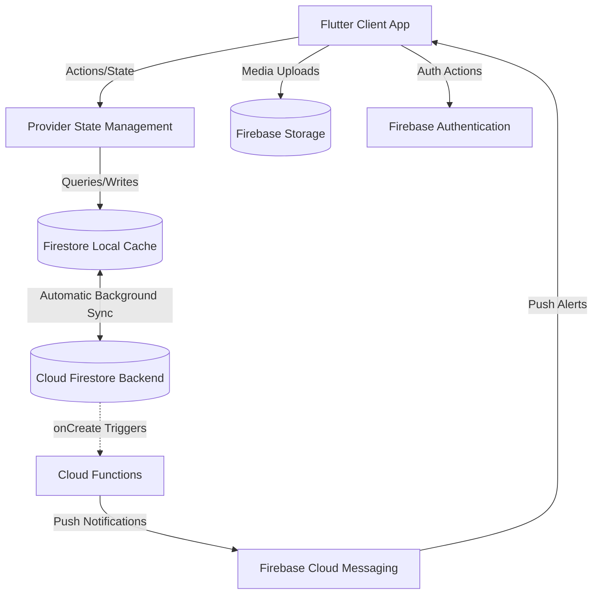

# Family Tree App: Architecture & Interview Cheat Sheet

This guide provides a comprehensive overview of the technical architecture, custom algorithms, offline database mechanics, and push notification routing for the Family Tree App. It is designed to prepare you for technical interviews and help you explain the inner workings of the project with confidence.

---

## 1. System Architecture Overview

The system is structured as an **Offline-First Multi-Role Mobile Application** built on the Flutter client and Firebase backend stack.



### Core Stack & Roles:
1. **Frontend**: **Flutter (Dart)** - A cross-platform framework for iOS/Android compiling natively.
2. **State Management**: **Provider** - Lightweight dependency injection and ChangeNotifier-based state rebuilds.
3. **Database**: **Cloud Firestore** - Real-time document-oriented database with local cache persistence.
4. **Media Store**: **Firebase Storage** - Handles family photos, profile pictures, and event attachments.
5. **Backend Logic**: **Firebase Cloud Functions (TypeScript)** - Trigger-based backend compute for push messaging and data synchronization.
6. **Authentication**: **Firebase Auth** - Dynamic authentication using phone/synthetic email aliases.

---

## 2. "Offline-First" Database & Image Caching

One of the most complex parts of this app is its ability to run completely offline without crashing, allowing users to modify tree details, add family members, and view cached images.

### Firestore Local Database Syncing
* **Caching Enabled**: In [main.dart](file:///f:/internship/Family%20Tree/familytree/lib/main.dart), we configure the Firestore instance with:
  ```dart
  FirebaseFirestore.instance.settings = const Settings(
    persistenceEnabled: true,
    cacheSizeBytes: Settings.CACHE_SIZE_UNLIMITED,
  );
```
* **Offline Read Cache Fallback**: When fetching documents (like the user profile on startup) offline, standard Firestore reads (`Source.serverAndCache`) can throw exceptions. We added explicit catch blocks in [firebase_service.dart](file:///f:/internship/Family%20Tree/familytree/lib/core/services/firebase_service.dart) (`getMemberByUid` and `getMasterByUid`) to try `Source.cache`. If that fails, it returns `null` instead of throwing a blocking error, allowing the AuthGate to load the dashboard successfully using cached data.
* **Write Operations Queueing**: When offline, Firestore `set()`, `update()`, and `delete()` operations immediately modify the local cache (which triggers local UI updates). Firestore automatically registers these writes in an internal queue and synchronizes them to the Firebase server in the correct order once connection is restored.
* **Storage Upload Tolerance**: Firebase Storage does not have offline caching. We wrapped storage upload calls (profile pictures, family photos, event attachments) in try-catch blocks. If a user is offline, the upload fails silently, letting the text and metadata modifications proceed and cache successfully in Firestore.

### Offline Auth Account Creation Trigger
* **The Problem**: When adding a member offline, the client cannot call Firebase Auth (`createUserWithEmailAndPassword`). It falls back to writing the member document locally with a generated password and email.
* **The Solution**: We created a Cloud Function trigger (`onMemberCreated`) in [index.ts](file:///f:/internship/Family%20Tree/functions/src/index.ts). As soon as the client goes online and the member document syncs, the trigger runs on the server, checks if the Auth account exists, and creates it:
  ```typescript
  export const onMemberCreated = functions.firestore
    .document("members/{memberId}")
    .onCreate(async (snapshot, context) => {
      // Creates Auth user account on the server using document ID as uid!
      await admin.auth().createUser({
        uid: memberId,
        email: authEmail,
        password: password,
      });
    });
  ```

### Media Caching via CachedNetworkImage
* If we loaded images directly using `Image.network(url)` or `NetworkImage(url)`, they would disappear when offline because they fetch directly from web URLs.
* We converted all network image widgets to use **`CachedNetworkImage`** and **`CachedNetworkImageProvider`**. This automatically downloads images, stores them in the device's local cache directory, and displays them immediately from the local store when offline.

---

## 3. Dynamic Family Tree Layout Engine (The Algorithm)

The family tree visualization is built on a custom layout engine that places cards dynamically in a scrollable, zoomable canvas based on member relationships.

```
       [Grandfather]  =====  [Grandmother]
                        |  (Spouse Connector)
                        |
            +-----------+-----------+
            | (Collector Line)      |
      [Father] == [Mother]       [Uncle]
               |
        +------+------+
        |             |
     [Son]         [Daughter]
```

### Tree Calculations Flow ([tree_layout.dart](file:///f:/internship/Family%20Tree/familytree/lib/views/family/tree_layout.dart))
The algorithm computes coordinates `(x, y)` for each member in 7 distinct steps:

1. **Generation Assignment (Y-Axis Placement)**:
   - Root nodes are identified (members whose parents are not in the visible list).
   - A Breadth-First Search (BFS) assigns generation levels (depths) starting from root nodes (Gen 0) down to children (Gen 1, Gen 2, etc.).
   - The Y-coordinate is computed as: `y = padding_y + generation * (card_height + vertical_gap)`.
2. **Spouse Generation Syncing**:
   - Spouses can sometimes be assigned different generations initially (e.g. if one spouse was entered as a root and the other has visible parents).
   - An iterative loop ensures both spouses are assigned the maximum generation level of the couple, keeping their cards perfectly aligned on the same horizontal row.
3. **Left/Right Spouse Pairing**:
   - A couple consists of a "Left" (primary) card and a "Right" (secondary) card.
   - Spouses are sorted left-to-right based on lineage (parent links), gender (male on left), or ID to maintain a consistent card placement order.
4. **Lineage Mapping**:
   - Children nodes are attached to the left parent card to construct the subtrees.
5. **Subtree Width Calculation**:
   - Before positioning, `subtreeWidth(node)` recursively computes the exact width of space needed for a node's complete family tree subtree (itself, spouse, and children).
6. **Recursive Node Placement (X-Axis Placement)**:
   - Starting from the top-left root node, `layoutNode(node, leftX)` centers couples over their children's total subtree width.
   - If the children require more space than the parents, the parent couple is centered over the children.
   - If the parents are wider, the children are centered beneath them.
7. **Line Connections Drawing ([tree_painter.dart](file:///f:/internship/Family%20Tree/familytree/lib/views/family/tree_painter.dart))**:
   - A custom `CustomPainter` draws connection lines under the cards.
   - **Spouse line**: A horizontal connector with a stylized diamond at the midpoint.
   - **Drop bar**: A vertical line dropping from the couple's midpoint.
   - **Collector line**: A horizontal bar linking all siblings.
   - **Child rise**: A vertical segment going up from the collector bar to each child's top boundary.

---

## 4. Push Notification & Deep Link Routing

The application supports real-time push alerts on events, which dynamically direct users to event details.

```
Incoming Push Alert -> Tap Notification -> AppDelegate/MainActivity ->
Global navigatorKey -> Read Event ID -> Fetch Event Document -> Route to EventDetailScreen
```

1. **FCM Token Registration**:
   - On login/restore, the app registers the device's FCM token in the `/fcm_tokens/{token}` collection, tagging it with the user's `memberId` and `familyId` (or `'master'`).
2. **Broadcast Trigger (Cloud Functions)**:
   - When a family event is created, `onFamilyEventCreated` fires.
   - It reads FCM tokens matching the `familyId` (excluding the creator) and `'master'` tokens.
   - It constructs payload messages containing `eventId` and `familyId` and sends them via `admin.messaging().sendEach()`.
3. **Foreground / Background Handlers**:
   - If the app is in the foreground, FCM payloads are intercepted, and local push notifications are triggered using `flutter_local_notifications`.
   - If the app is in the background or closed (cold boot), the system registers the tap event.
4. **Deep-Link Routing**:
   - We utilize a global `navigatorKey` in `MaterialApp` to access the navigation context anywhere in the app without having to pass `BuildContext`.
   - The tapped notification payload (serialized in JSON) is read.
   - The app fetches the target event from Firestore and pushes `EventDetailScreen` onto the navigation stack.

---

## 5. Seen/Read Notifications Status

* **Tracking**: Notifications have a `readBy` array containing UIDs of users who have viewed them.
* **Badge Counts**: Dashboard badges count only notifications where `readBy` does NOT contain the current user's UID.
* **Auto-Mark as Read**: When a user opens the notifications screen, the app gathers all unread notification IDs and triggers a batched update (`markNotificationsAsRead`) in [firebase_service.dart](file:///f:/internship/Family%20Tree/familytree/lib/core/services/firebase_service.dart) to append the user's UID to `readBy` in a single transaction.

---

## 6. Firestore Security Rules Model

To protect user data, we configured a strict declarative security rules model in [firestore.rules](file:///f:/internship/Family%20Tree/firestore.rules):

* `isMaster()`: Verifies if the request UID exists in the `/masters` metadata collection.
* `callerMember()`: Queries the `/members` collection for the request UID to fetch their profile role and `familyId`.
* **Access Isolation**:
  - Families can only be read/updated by the Master or members belonging to that family (`isMemberOfFamily(familyId)`).
  - Events subcollection permissions:
    - **Create**: Only members of the family who populate their UID in `createdBy`.
    - **Update/Delete**: Only the Master, the Family Admin (`callerMember().role == 'admin'`), or the original creator of that specific event.
  - Notifications collection: Allowed updates only for members of the family or the target recipient (to update the `readBy` seen status).

---

## 7. Typical Interview Questions & Answers

### Q: "How did you design the database to work offline?"
**Answer**:
> "I designed the app with an Offline-First approach. I enabled Firestore's native database persistence caching in `main.dart`. All reads are queried against local cache if the network fails, and writes are recorded instantly locally (triggering real-time UI updates) and queued to sync with Firestore as soon as internet is restored.
>
> For media assets, I integrated `CachedNetworkImage` which caches profile pictures and family photos locally. For actions like uploading images or creating Firebase Auth accounts which require active network connectivity, I wrapped storage uploads in try-catch blocks to allow offline writes to succeed without error. I then built a Firestore onCreate Cloud Function trigger that listens for new members and automatically creates their Firebase Auth accounts on the server as soon as the offline cached document syncs online."

### Q: "Explain the family tree drawing algorithm. How did you structure it?"
**Answer**:
> "Drawing a family tree is a classic graph layout problem. I built a custom layout engine in Dart.
>
> First, it parses visible members and computes generation depths using a Breadth-First Search (BFS) starting from roots (members without parents in the tree).
>
> Second, it aligns spouse cards horizontally by syncing their generation depths to the maximum of the couple.
>
> Third, it computes positions on the X-axis recursively using a post-order tree traversal. It calculates the width of each family subtree, centers parent couples over their children's subtree width, and positions sibling nodes next to each other with a spacing gap.
>
> Finally, I implemented a `CustomPainter` (`TreePainter`) to draw connecting lines underneath the cards, dividing them into spouse lines, vertical drop lines, horizontal collectors, and child rises."

### Q: "How does deep-linking for notifications work if the app is completely closed?"
**Answer**:
> "When the app launches from a terminated state (cold boot) via a notification tap, the notification payload is passed to the app during launch options.
>
> I configured the startup pipeline in `AuthProvider`'s session restoration to check for pending notification payloads. Once the user's session is loaded from cache or server, the payload is parsed, the event document is fetched from Firestore, and we use a global `navigatorKey` to push the `EventDetailScreen` onto the navigation stack, routing the user directly to the event details screen."

### Q: "Why did you use Cloud Functions instead of writing notifications on the client?"
**Answer**:
> "Writing notifications directly on the client violates security rules and isn't reliable. If a client creates an event and loses network connection immediately, they wouldn't be able to notify other users.
>
> By using Cloud Functions Firestore onCreate triggers, the notification broadcasting logic runs in a secure, server-side environment. As soon as the event document is synced to Firestore, the function retrieves the relevant FCM tokens for the family and master, and dispatches the push messages. This keeps the client thin and ensures high reliability."
